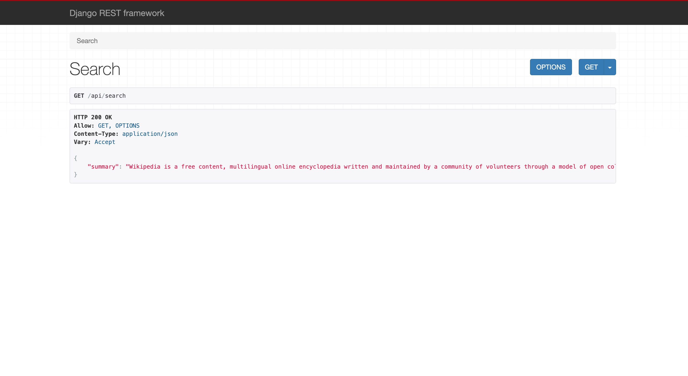

## Big word search

### Problem Definition
Create a django project analyse whether a particular wikipedia page includes alot of big words.

1. create new branch off of main
    - create django project (follow tutorial https://docs.djangoproject.com/en/3.2/intro/tutorial01/)
    - create app called wiki_stats
    - create services.py file in wiki_stats app
    - In services.py, write a function to fetch summary section of a wikipedia page by passing title argument and using
      wikipedia api.
    - In services.py, write a second function to interpret the amount of 5+ letter words in the summary section.
    - Return an alert in the second function if more than 20% of words are 5+ letter words.
    - Send an email if an alert exists (https://docs.djangoproject.com/en/3.2/topics/email/)
    - create a function based view in wiki_stats/views (use api_view from django rest
      framework : https://www.django-rest-framework.org/api-guide/views/#api_view)
        - input request.GET.get('title') and return results of service in previous steps
    - capture screenshot of browser with view response
    - add requirements.txt file with project dependencies
    - add README for how to run your project
13. create pull request of your branch pointing to branch:main with screenshot in PR description

### Enable Email Service

Email service needs to be configured for sending email once the summary contains the more than 20 percentage of words
with length greater than 5. I have used gmail as email sender. To configured it, need to set the environment variable in
file .env on root directory of project.

wordsearch/.env

```shell
MAIL_PORT=587
MAIL_PASSWORD=YOUR_SENDER_GMAIL_PASSWORD
SENDER_EMAIL=SENDER_GMAIL_ADDRESS
RECEIVER_EMAIL=RECEIVER_GMAIL_ADDRESS
SMTP=smtp.gmail.com
```

### Run Application

Change to the root directory of the project as

1. Navigate to root directory

```shell
cd wordsearch
```

2. Run Application

```shell
 python manage.py runserver
```

### Run Test

1. Change directory to wiki_stats app as:

```shell
 cd wiki_stats
```

2. Run tests as:

```shell
pytest
```

### Screenshot of application


